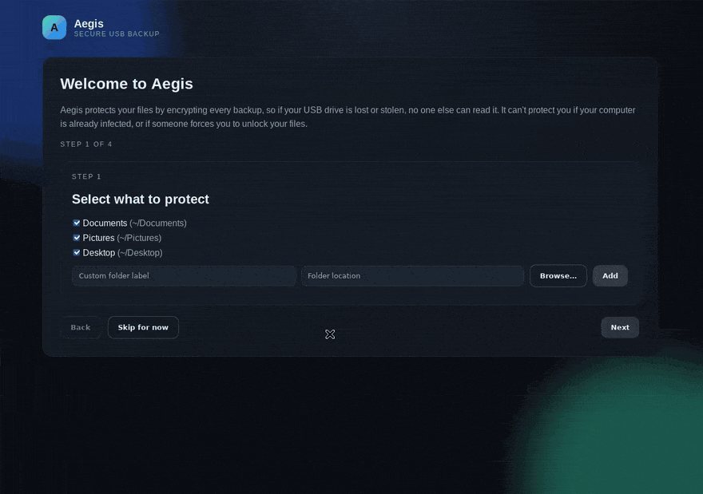

# Aegis

[](https://github.com/stcksmsh/aegis/actions/workflows/ci.yml)
[](https://github.com/stcksmsh/aegis/releases/latest)

[](#for-developers)

**Encrypted backups to a USB drive. Plug in → backed up.**

Aegis copies your important folders to a USB drive and locks them with a passphrase only you know. If your laptop dies, gets stolen, or gets hit by ransomware, plug the drive into any computer and get your files back. If someone steals the drive, they get nothing.



## Download

Get the installer for your computer from the **[latest release](https://github.com/stcksmsh/aegis/releases/latest)**:

| Computer | File to download |
|---|---|
| Windows 10 / 11 | `Aegis_…_x64-setup.exe` |
| Mac with Apple chip (M1 and newer) | `Aegis_…_aarch64.dmg` |
| Mac with Intel chip | `Aegis_…_x64.dmg` |
| Ubuntu / Debian / Mint | `Aegis_…_amd64.deb` |
| Other Linux | `Aegis_…_amd64.AppImage` |

Everything Aegis needs is inside the installer. Nothing else to set up.

First launch shows a warning because the app isn't signed by Apple/Microsoft yet:
**Windows**: "More info" → "Run anyway". **Mac**: right-click the app → "Open" → "Open".

## How it works

1. **Pick folders** — Documents, Pictures, Desktop, or anything else.
2. **Pick a passphrase** — write it down. No one (not even Aegis) can recover it.
3. **Plug in a USB drive** — Aegis sets it up without deleting what's already on it.
4. **Done.** Next time you plug the drive in, Aegis backs up by itself. Only changed files are copied, so later backups are fast.

Restore: open Aegis → **Restore** → pick a date → pick a folder. New computer? Install Aegis, plug in the drive, type your passphrase.

Full walkthrough: **[User Guide](docs/USER_GUIDE.md)** · all docs: **[docs/](docs/README.md)**.

## What you get

| Feature | |
|---|---|
| Strong encryption | Every backup is encrypted (AES-256) before it touches the drive. |
| Automatic | Backs up when you plug in your drive. Runs quietly in the tray / menu bar. |
| History | Keeps every past version until you choose to clean up. Get back last week's file. |
| Get back one file | Browse any past backup and restore just the files you need. Never overwrites what's already there. |
| Reminders | Nudges you when it's been a week since your last backup. Optional hourly backups while the drive stays plugged in. |
| Drive space | Shows free space and warns before your drive fills up. |
| Safe to unplug | Unplugging mid-backup never damages earlier backups. |
| Checks itself | Verifies each backup after it finishes. |
| No lock-in | Backups use the open [restic](https://restic.net) format. Readable without Aegis. |
| Private | No accounts, no cloud, no internet. Your passphrase is never saved to disk (optionally kept in your system keychain). |
| Windows, macOS, Linux | Same app everywhere. A drive made on one works on the others (use exFAT). |

## For developers

```bash
bash scripts/fetch-restic.sh x86_64-unknown-linux-gnu   # bundled restic (your target triple)
cargo run -p aegis-ui                                    # desktop app with embedded agent
```

- [CONTRIBUTING.md](CONTRIBUTING.md) — setup, checks, release process
- [CLAUDE.md](CLAUDE.md) — project layout and rules
- [docs/ipc.md](docs/ipc.md) — local API
- [docs/AGENT_SERVICE.md](docs/AGENT_SERVICE.md) — run the agent headless as a service (optional)
- [CHANGELOG.md](CHANGELOG.md)
- [SECURITY.md](SECURITY.md) — how Aegis protects your data; reporting vulnerabilities

Rust + [Tauri](https://tauri.app), backups by [restic](https://restic.net). License: [MIT](LICENSE-MIT) OR [Apache-2.0](LICENSE-APACHE).
